## 概述

对于没有做过任何音视频编解码的小白来说，如果忽然让你去搞音视频编解码，你肯定会一头雾水。所以弄清楚关于音视频编码的一些概念是非常的重要的。这篇文章就是为在IOS系统中进行H264编解码做的知识铺垫。具体包含以下内容：

* 对视频编解码的概述
* H.264编码原理以及对I帧、B帧、P帧的介绍
* IOS系统H.264视频硬件编解码说明

## 对视频编解码的概述

关于什么是视频编码以及视频编解码技术，在以前的文章中已经有所介绍，在此不再赘述。视频编解码分为软编码和硬编码。

### 软编码和硬编码的概念

软编码：使用CPU进行编码。

硬编码：不使用CPU进行编码，使用显卡GPU,专用的DSP、FPGA、ASIC芯片等硬件进行编码。

### 软编码和硬编码的比较

软编码：实现直接、简单，参数调整方便，升级易，但CPU负载重，性能较硬编码低，低码率下质量通常比硬编码要好一点。

硬编码：性能高，低码率下通常质量低于硬编码器，但部分产品在GPU硬件平台移植了优秀的软编码算法（如X264）的，质量基本等同于软编码。

### IOS系统中的硬编码

苹果在iOS 8.0系统之前，没有开放系统的硬件编码解码功能，不过Mac OS系统一直有，被称为Video ToolBox的框架来处理硬件的编码和解码，终于在iOS 8.0后，苹果将该框架引入iOS系统。

## H.264编码原理以及I帧B帧P帧

### H.264编码原理

 H264是新一代的编码标准，以高压缩高质量和支持多种网络的流媒体传输著称，在编码方面，我理解的他的理论依据是：参照一段时间内图像的统计结果表明，在相邻几幅图像画面中，一般有差别的像素只有10%以内的点,亮度差值变化不超过2%，而色度差值的变化只有1%以内。所以对于一段变化不大图像画面，我们可以先编码出一个完整的图像帧A，随后的B帧就不编码全部图像，只写入与A帧的差别，这样B帧的大小就只有完整帧的1/10或更小！B帧之后的C帧如果变化不大，我们可以继续以参考B的方式编码C帧，这样循环下去。这段图像我们称为一个序列（序列就是有相同特点的一段数据），当某个图像与之前的图像变化很大，无法参考前面的帧来生成，那我们就结束上一个序列，开始下一段序列，也就是对这个图像生成一个完整帧A1，随后的图像就参考A1生成，只写入与A1的差别内容。
  
在H264协议里定义了三种帧，完整编码的帧叫I帧，参考之前的I帧生成的只包含差异部分编码的帧叫P帧，还有一种参考前后的帧编码的帧叫B帧。

H264采用的核心算法是帧内压缩和帧间压缩，帧内压缩是生成I帧的算法，帧间压缩是生成B帧和P帧的算法。

### 对序列的说明

在H264中图像以序列为单位进行组织，一个序列是一段图像编码后的数据流，以I帧开始，到下一个I帧结束。

一个序列的第一个图像叫做 IDR 图像（立即刷新图像），IDR 图像都是 I 帧图像。H.264 引入 IDR 图像是为了解码的重同步，当解码器解码到 IDR 图像时，立即将参考帧队列清空，将已解码的数据全部输出或抛弃，重新查找参数集，开始一个新的序列。这样，如果前一个序列出现重大错误，在这里可以获得重新同步的机会。IDR图像之后的图像永远不会使用IDR之前的图像的数据来解码。

一个序列就是一段内容差异不太大的图像编码后生成的一串数据流。当运动变化比较少时，一个序列可以很长，因为运动变化少就代表图像画面的内容变动很小，所以就可以编一个I帧，然后一直P帧、B帧了。当运动变化多时，可能一个序列就比较短了，比如就包含一个I帧和3、4个P帧。

### 对三种帧的介绍

#### I帧

为了更好地理解I帧的概念，我罗列了两种解释：

* 帧内编码帧 ，I帧表示关键帧，你可以理解为这一帧画面的完整保留；解码时只需要本帧数据就可以完成（因为包含完整画面）。

* 帧内编码帧 又称intra picture，I 帧通常是每个 GOP（MPEG 所使用的一种视频压缩技术）的第一个帧，经过适度地压缩，做为随机访问的参考点，可以当成图象。I帧可以看成是一个图像经过压缩后的产物。

I帧的特点：

* 它是一个全帧压缩编码帧。它将全帧图像信息进行JPEG压缩编码及传输
* 解码时仅用I帧的数据就可重构完整图像
* I帧描述了图像背景和运动主体的详情
* I帧不需要参考其他画面而生成
* I帧是P帧和B帧的参考帧(其质量直接影响到同组中以后各帧的质量)
* I帧是帧组GOP的基础帧(第一帧),在一组中只有一个I帧
* I帧不需要考虑运动矢量
* I帧所占数据的信息量比较大

#### P帧

为了更好地理解P帧的概念，我也罗列了两种解释：

* 前向预测编码帧。P帧表示的是这一帧跟之前的一个关键帧（或P帧）的差别，解码时需要用之前缓存的画面叠加上本帧定义的差别，生成最终画面。（也就是差别帧，P帧没有完整画面数据，只有与前一帧的画面差别的数据）
* 前向预测编码帧 又称predictive-frame，通过充分将低于图像序列中前面已编码帧的时间冗余信息来压缩传输数据量的编码图像，也叫预测帧

**P帧的预测与重构：**P帧是以I帧为参考帧,在I帧中找出P帧“某点”的预测值和运动矢量,取预测差值和运动矢量一起传送。在接收端根据运动矢量从I帧中找出P帧“某点”的预测值并与差值相加以得到P帧“某点”样值,从而可得到完整的P帧。

P帧特点: 

* P帧是I帧后面相隔1~2帧的编码帧
* P帧采用运动补偿的方法传送它与前面的I或P帧的差值及运动矢量(预测误差) 
* 解码时必须将I帧中的预测值与预测误差求和后才能重构完整的P帧图像 
* P帧属于前向预测的帧间编码。它只参考前面最靠近它的I帧或P帧 
* P帧可以是其后面P帧的参考帧,也可以是其前后的B帧的参考帧 
* 由于P帧是参考帧,它可能造成解码错误的扩散 
* 由于是差值传送,P帧的压缩比较高 

#### B帧

为了更好地理解P帧的概念，我依然罗列了两种解释：

* 双向预测内插编码帧。B帧是双向差别帧，也就是B帧记录的是本帧与前后帧的差别（具体比较复杂，有4种情况，但我这样说简单些），换言之，要解码B帧，不仅要取得之前的缓存画面，还要解码之后的画面，通过前后画面的与本帧数据的叠加取得最终的画面。B帧压缩率高，但是解码时CPU会比较累。
* 双向预测内插编码帧 又称bi-directional interpolated prediction frame，既考虑与源图像序列前面已编码帧，也顾及源图像序列后面已编码帧之间的时间冗余信息来压缩传输数据量的编码图像，也叫双向预测帧；

**B帧的预测与重构：**B帧以前面的I或P帧和后面的P帧为参考帧,“找出”B帧“某点”的预测值和两个运动矢量,并取预测差值和运动矢量传送。接收端根据运动矢量在两个参考帧中“找出(算出)”预测值并与差值求和,得到B帧“某点”样值,从而可得到完整的B帧。

B帧的特点：

* B帧是由前面的I或P帧和后面的P帧来进行预测的 
* B帧传送的是它与前面的I或P帧和后面的P帧之间的预测误差及运动矢量 
* B帧是双向预测编码帧 
* B帧压缩比最高,因为它只反映丙参考帧间运动主体的变化情况,预测比较准确 
* B帧不是参考帧,不会造成解码错误的扩散

I、B、P各帧是根据压缩算法的需要，是人为定义的,它们都是实实在在的物理帧。一般来说，I帧的压缩率是7（跟JPG差不多），P帧是20，B帧可以达到50。可见使用B帧能节省大量空间，节省出来的空间可以用来保存多一些I帧，这样在相同码率下，可以提供更好的画质。

#### 对压缩算法的说明

h264的压缩方法:

1. 分组:把几帧图像分为一组(GOP，也就是一个序列),为防止运动变化,帧数不宜取多。 
2. 定义帧:将每组内各帧图像定义为三种类型,即I帧、B帧和P帧; 
3. 预测帧:以I帧做为基础帧,以I帧预测P帧,再由I帧和P帧预测B帧; 
4. 数据传输:最后将I帧数据与预测的差值信息进行存储和传输。

帧内（Intraframe）压缩也称为空间压缩（Spatial compression）。当压缩一帧图像时，仅考虑本帧的数据而不考虑相邻帧之间的冗余信息，这实际上与静态图像压缩类似。帧内一般采用有损压缩算法，由于帧内压缩是编码一个完整的图像，所以可以独立的解码、显示。帧内压缩一般达不到很高的压缩，跟编码jpeg差不多。
  
帧间（Interframe）压缩的原理是：相邻几帧的数据有很大的相关性，或者说前后两帧信息变化很小的特点。也即连续的视频其相邻帧之间具有冗余信息,根据这一特性，压缩相邻帧之间的冗余量就可以进一步提高压缩量，减小压缩比。帧间压缩也称为时间压缩（Temporal compression），它通过比较时间轴上不同帧之间的数据进行压缩。帧间压缩一般是无损的。帧差值（Frame differencing）算法是一种典型的时间压缩法，它通过比较本帧与相邻帧之间的差异，仅记录本帧与其相邻帧的差值，这样可以大大减少数据量。

顺便说下有损（Lossy ）压缩和无损（Lossy less）压缩。无损压缩也即压缩前和解压缩后的数据完全一致。多数的无损压缩都采用RLE行程编码算法。有损压缩意味着解压缩后的数据与压缩前的数据不一致。在压缩的过程中要丢失一些人眼和人耳所不敏感的图像或音频信息,而且丢失的信息不可恢复。几乎所有高压缩的算法都采用有损压缩,这样才能达到低数据率的目标。丢失的数据率与压缩比有关,压缩比越小，丢失的数据越多,解压缩后的效果一般越差。此外,某些有损压缩算法采用多次重复压缩的方式,这样还会引起额外的数据丢失。

#### 三种帧的不同

* I frame:自身可以通过视频解压算法解压成一张单独的完整的图片。
* P frame：需要参考其前面的一个I frame 或者B frame来生成一张完整的图片。
* B frame:则要参考其前一个I或者P帧及其后面的一个P帧来生成一张完整的图片。
* 两个I frame之间形成一个GOP，在x264中同时可以通过参数来设定bf的大小，即：I 和p或者两个P之间B的数量。
* 通过上述基本可以说明如果有B frame 存在的情况下一个GOP的最后一个frame一定是P.

#### DTS和PTS的不同

DTS主要用于视频的解码,在解码阶段使用.PTS主要用于视频的同步和输出.在display的时候使用.在没有B frame的情况下.DTS和PTS的输出顺序是一样的。

例子:

下面给出一个GOP为15的例子,其解码的参照frame及其解码的顺序都在里面:

如上图：I frame 的解码不依赖于任何的其它的帧.而p frame的解码则依赖于其前面的I frame或者P frame.B frame的解码则依赖于其前的最近的一个I frame或者P frame 及其后的最近的一个P frame.

## IOS系统 H.264视频硬件编解码说明

我们知道，在IOS8系统以后，苹果将Mac OS中用于硬件编解码 `VideoToolbox` 框架引入IOS系统。

按照苹果WWDC2014 513《direct access to media encoding and decoding》的描述，苹果之前提供的AVFoundation框架也使用硬件对视频进行硬编码和解码，但是编码后直接写入文件，解码后直接显示。Video Toolbox框架可以得到编码后的帧结构，也可以得到解码后的原始图像，因此具有更大的灵活性做一些视频图像处理。

### 对VideoToolbox的介绍

在iOS中，与视频相关的接口有5个，从顶层开始分别是 AVKit - AVFoundation - VideoToolbox - Core Media - Core Video

其中VideoToolbox可以将视频解压到CVPixelBuffer,也可以压缩到CMSampleBuffer。

如果需要使用硬编码的话，在5个接口中，就需要用到AVKit，AVFoundation和VideoToolbox。在这里我就只介绍VideoToolbox。

#### VideoToolbox中的对象

* CVPixelBuffer :  编码前和解码后的图像数据结构（未压缩光栅图像缓存区-Uncompressed Raster Image Buffer）

  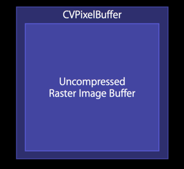
  
* CVPixelBufferPool : 顾名思义，存放CVPixelBuffer
  
  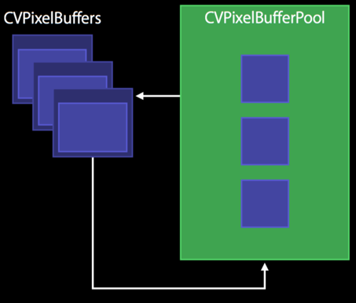
  
* pixelBufferAttributes : CFDictionary对象，可能包含了视频的宽高，像素格式类型（32RGBA, YCbCr420），是否可以用于OpenGL ES等相关信息
* CMTime : 时间戳相关。时间以 64-big/32-bit形式出现。 分子是64-bit的时间值，分母是32-bit的时标(time scale)
* CMClock : 时间戳相关。时间以 64-big/32-bit形式出现。 分子是64-bit的时间值，分母是32-bit的时标(time scale)。它封装了时间源，其中`CMClockGetHostTimeClock()`封装了`mach_absolute_time()`
* CMTimebase : 时间戳相关。时间以 64-big/32-bit形式出现。CMClock上的控制视图。提供了时间的映射:`CMTimebaseSetTime(timebase, kCMTimeZero);` 速率控制: `CMTimebaseSetRate(timebase, 1.0);`

	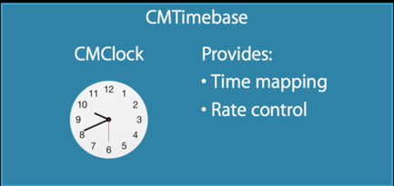
	
* CMBlockBuffer : 编码后，结果图像的数据结构
* CMVideoFormatDescription : 图像存储方式，编解码器等格式描述
* CMSampleBuffer : 存放编解码前后的视频图像的容器数据结构

	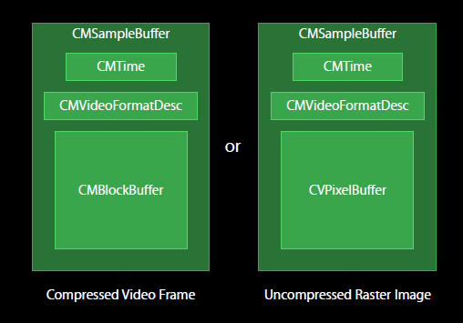
	
	如图所示，编解码前后的视频图像均封装在CMSampleBuffer中，如果是编码后的图像，以CMBlockBuffe方式存储；解码后的图像，以CVPixelBuffer存储。CMSampleBuffer里面还有另外的时间信息CMTime和视频描述信息CMVideoFormatDesc。

#### 硬解码

通过如图所示的一个典型应用，来说明如何使用硬件解码接口。该应用场景是从网络处传来H264编码后的视频码流，最后显示在手机屏幕上。

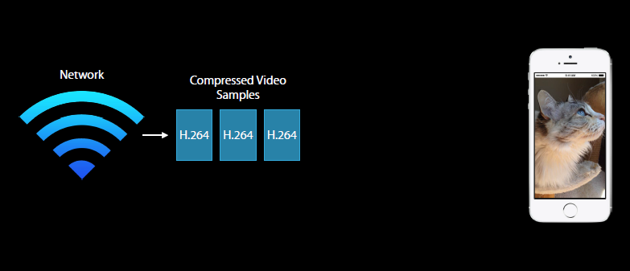

要完成以上功能需要经过以下几个步骤：

1. 将 H.264码流转换为 CMSampleBuffer
2. 将 CMSampleBuffer显示出来 

##### 将H.264码流转化成CMSampleBuffer

我们知道，CMSampleBuffer = CMTime + FormatDesc + CMBlockBuffer . 需要从H264的码流里面提取出以上的三个信息。最后组合成CMSampleBuffer，提供给硬解码接口来进行解码工作。

在H.264的语法中，有一个最基础的层，叫做Network Abstraction Layer, 简称为NAL。H.264流数据正是由一系列的NAL单元(NAL Unit, 简称NAUL)组成的。

H264的码流由NALU单元组成,一个NALU可能包含有：

* 视频帧

	视频帧也就是视频片段，具体有 P帧, I帧，B帧
	
	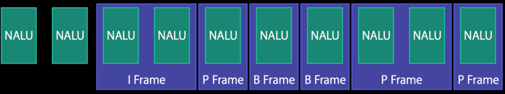

* H.264属性合集-FormatDesc(包含 SPS和PPS)
	
	流数据中，属性集合可能是这样的：
	
	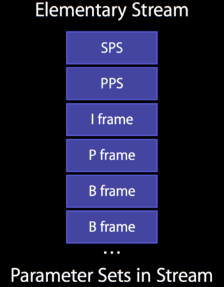
	
	经过处理之后，在Format Description中则是:
	
	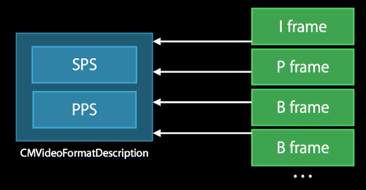
	
	要从基础的流数据将SPS和PPS转化为Format Desc中的话，需要调用`CMVideoFormatDescriptionCreateFromH264ParameterSets()`方法

NALU header

对于流数据来说，一个NAUL的Header中，可能是0x00 00 01或者是0x00 00 00 01作为开头(两者都有可能，下面以0x00 00 01作为例子)。0x00 00 01因此被称为开始码(Start code).

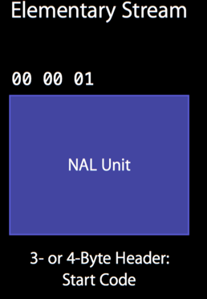

	
总结以上知识，我们知道H264的码流由NALU单元组成，NALU单元包含视频图像数据和H264的参数信息。其中视频图像数据就是CMBlockBuffer，而H264的参数信息则可以组合成FormatDesc。具体来说参数信息包含SPS（Sequence Parameter Set）和PPS（Picture Parameter Set）.如下图显示了一个H.264码流结构：

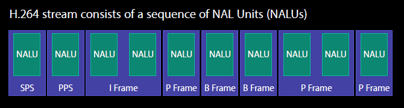
	
1） 提取sps和pps生成FormatDesc

* 每个NALU的开始码是0x00 00 01，按照开始码定位NALU
* 通过类型信息找到sps和pps并提取，开始码后第一个byte的后5位，7代表sps，8代表pps
* 使用CMVideoFormatDescriptionCreateFromH264ParameterSets函数来构建CMVideoFormatDescriptionRef

2）提取视频图像数据生成CMBlockBuffer

* 通过开始码，定位到NALU
* 确定类型为数据后，将开始码替换成NALU的长度信息（4 Bytes）
* 使用CMBlockBufferCreateWithMemoryBlock接口构造CMBlockBufferRef

3）根据需要，生成CMTime信息。（实际测试时，加入time信息后，有不稳定的图像，不加入time信息反而没有，需要进一步研究，这里建议不加入time信息）

根据上述得到CMVideoFormatDescriptionRef、CMBlockBufferRef和可选的时间信息，使用CMSampleBufferCreate接口得到CMSampleBuffer数据这个待解码的原始的数据。如下图所示的H264数据转换示意图。

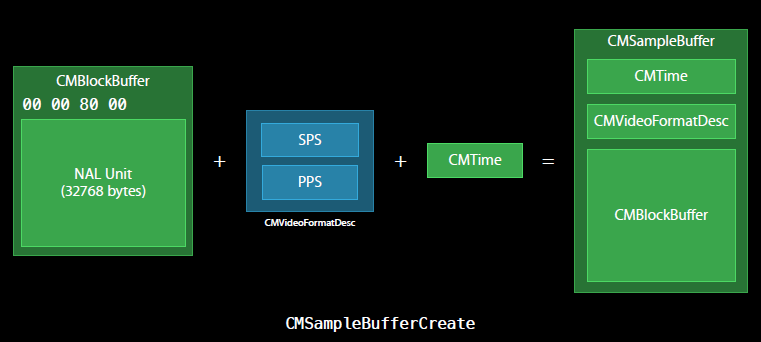

##### 将CMSampleBuffer显示出来

显示的方式有两种：

* 将CMSampleBuffers提供给系统的AVSampleBufferDisplayLayer 直接显示
* 利用OPenGL自己渲染

1）通过系统提供的AVSampleBufferDisplayLayer来解码并显示

使用方式和其它CALayer类似。该层内置了硬件解码功能，将原始的CMSampleBuffer解码后的图像直接显示在屏幕上面，非常的简单方便。

2）利用OPenGL自己渲染

通过VTDecompression接口来，将CMSampleBuffer解码成图像，将图像通过UIImageView或者OpenGL上显示。

* 初始化VTDecompressionSession，设置解码器的相关信息。初始化信息需要CMSampleBuffer里面的FormatDescription，以及设置解码后图像的存储方式。demo里面设置的CGBitmap模式，使用RGB方式存放。编码后的图像经过解码后，会调用一个回调函数，将解码后的图像交个这个回调函数来进一步处理。我们就在这个回调里面，将解码后的图像发给control来显示，初始化的时候要将回调指针作为参数传给create接口函数。最后使用create接口对session来进行初始化。
* a中所述的回调函数可以完成CGBitmap图像转换成UIImage图像的处理，将图像通过队列发送到Control来进行显示处理。
* 调用VTDecompresSessionDecodeFrame接口进行解码操作。解码后的图像会交由以上两步骤设置的回调函数，来进一步的处理。

#### 硬编码

硬编码的使用也通过一个典型的应用场景来描述。首先，通过摄像头来采集图像，然后将采集到的图像，通过硬编码的方式进行编码，最后编码后的数据将其组合成H264的码流通过网络传播。

下面是对具体步骤的说明：

1. 摄像头采集数据

	摄像头采集，iOS系统提供了AVCaptureSession来采集摄像头的图像数据。设定好session的采集解析度。再设定好input和output即可。output设定的时候，需要设置delegate和输出队列。在delegate方法，处理采集好的图像。
	
	图像输出的格式，是未编码的CMSampleBuffer形式。
	
2. 使用VTCompressionSession进行硬编码
	
	1）初始化VTCompressionSession
	
	VTCompressionSession初始化的时候，一般需要给出width宽，height长，编码器类型kCMVideoCodecType_H264等。然后通过调用VTSessionSetProperty接口设置帧率等属性，demo里面提供了一些设置参考，测试的时候发现几乎没有什么影响，可能需要进一步调试。最后需要设定一个回调函数，这个回调是视频图像编码成功后调用。全部准备好后，使用VTCompressionSessionCreate创建session
	
	2）提取摄像头采集的原始图像数据给VTCompressionSession来硬编码
	
	摄像头采集后的图像是未编码的CMSampleBuffer形式，利用给定的接口函数CMSampleBufferGetImageBuffer从中提取出CVPixelBufferRef，使用硬编码接口VTCompressionSessionEncodeFrame来对该帧进行硬编码，编码成功后，会自动调用session初始化时设置的回调函数。
	
	3）利用回调函数，将因编码成功的CMSampleBuffer转换成H264码流，通过网络传播
	
	基本上是硬解码的一个逆过程。解析出参数集SPS和PPS，加上开始码后组装成NALU。提取出视频数据，将长度码转换成开始码，组长成NALU。将NALU发送出去。
	

## 参考

* [iOS8系统H264视频硬件编解码说明](http://www.jianshu.com/p/a6530fa46a88)
* [VideoToolbox解析](http://www.jianshu.com/p/6dfe49b5dab8)
* [简单谈谈硬编码和软编码](http://blog.csdn.net/charleslei/article/details/44599041)
* [I,P，B帧和PTS，DTS的关系](http://www.cnblogs.com/qingquan/archive/2011/07/27/2118967.html)